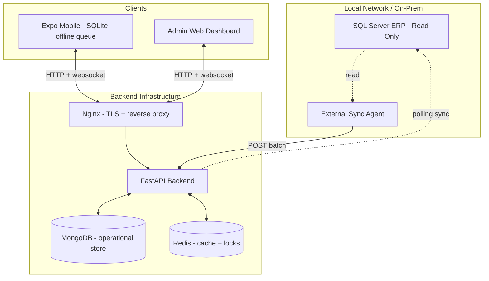
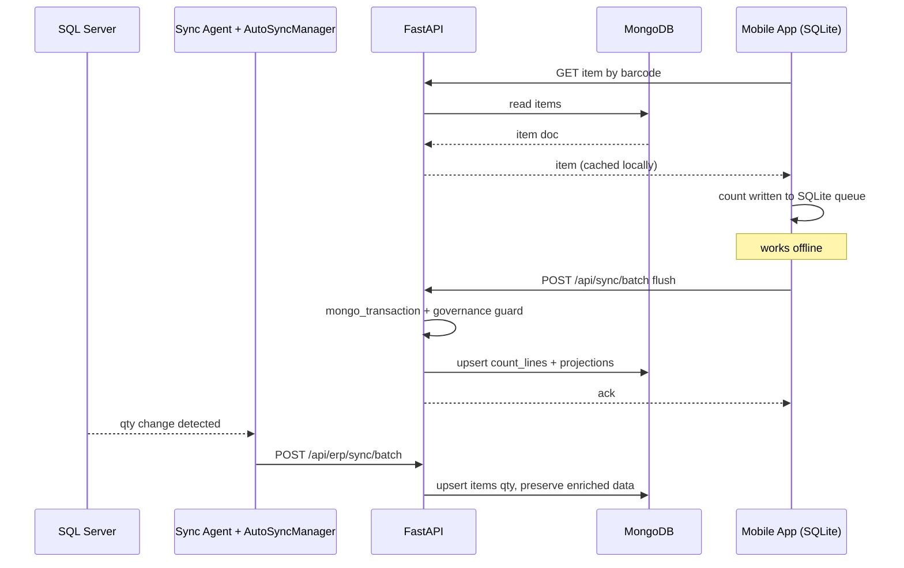

# Architecture Review & Improvement Plan — Stock Verification System

**Status:** Draft v3 for stakeholder approval — revised per review feedback  
**Scope:** [`Stock_final`](../Stock_final) — FastAPI backend, React Native/Expo frontend, Docker infrastructure  
**Date:** 2026-07-28

> **What changed in v3:** Split Phase 3 into 3A (composition roots) and 3B (service chunking). Moved route-snapshot baseline, replica-set guard, and mobile compatibility policy into Phase 1 as mandatory implementation gates. Added explicit Phase 6 acceptance criteria and mobile route compatibility rules. Documented root cause of service bloat.

---

## 1. Executive Summary

The Stock Verification System is a mature, offline-first inventory application. Its high-level design is sound: SQL Server is a read-only ERP upstream, MongoDB is the operational store, FastAPI serves mobile/web clients, and Redis provides caching/locking.

The codebase is **functionally strong but structurally indebted**. Several god modules have formed ([`app_factory.py`](../Stock_final/backend/app_factory.py:1) 943 lines, [`core/lifespan.py`](../Stock_final/backend/core/lifespan.py:1) 1049 lines, [`count_line_write_service.py`](../Stock_final/backend/services/count_line_write_service.py:1) 1740 lines, [`sql_sync_service.py`](../Stock_final/backend/services/sql_sync_service.py:1) 1073 lines, [`config.py`](../Stock_final/backend/config.py:1) 762 lines), patterns were started and abandoned (empty backend [`repositories/`](../Stock_final/backend/repositories:1) — ironically the *frontend* already has repositories in [`src/data/repositories/`](../Stock_final/frontend/src/data:1)), and ~75 flat service files carry overlapping concerns.

**Quantified debt:** ~75 service files with at least 4 known duplication clusters (cache/redis ×3, locking ×2, rate-limiting ×2, projections ×3) ≈ 10 redundant modules; 5 modules over 750 lines; and ~40 routers wired with inconsistent prefixing. This yields hundreds of ambiguous import paths and a high blast radius for any change.

**v3 focus:** Risk is reduced by front-loading safety baselines (route snapshot, replica-set guard, mobile compatibility policy) and shrinking the blast radius of each refactor phase.

---

## 2. Current Architecture Overview



**Stack:**

- **Backend:** Python, FastAPI, Motor (async Mongo), Pydantic settings, Sentry, OpenTelemetry.
- **Frontend:** Expo / React Native v2.1.0, Zustand stores, React Query, MMKV + expo-sqlite offline, Playwright E2E.
- **Infra:** Docker Compose (dev + production), Nginx, Certbot, Prometheus/Grafana.

---

## 3. Strengths

| Area | Evidence |
| :--- | :--- |
| Clear domain intent | Offline-first, Mongo-primary design in [`ARCHITECTURE.md`](../Stock_final/ARCHITECTURE.md:1) |
| Transactional write paths | [`mongo_transaction()`](../Stock_final/backend/services/transaction_manager.py:45) used across 10+ write services with graceful standalone-Mongo fallback |
| Resilience primitives | [`auto_recovery.py`](../Stock_final/backend/services/auto_recovery.py:1) retry/backoff/jitter; [`circuit_breaker.py`](../Stock_final/backend/services/circuit_breaker.py:1); [`lock_manager.py`](../Stock_final/backend/services/lock_manager.py:1) |
| Router composition | [`RouterRegistry`](../Stock_final/backend/app/routers.py:11) frozen dataclass |
| Graceful degradation | Optional routers imported behind `try/except` |
| Production hardening | Healthchecks, Redis auth, forced HTTPS, docs disabled via [`_api_docs_enabled()`](../Stock_final/backend/app_factory.py:213) |
| Observability | Sentry + OpenTelemetry + Prometheus |
| Mature offline client | expo-sqlite queue ([`localDb.ts`](../Stock_final/frontend/src/db/localDb.ts:1)), background sync, connection monitoring |
| Frontend repositories | [`src/data/repositories/`](../Stock_final/frontend/src/data:1) already implements a gateway pattern |

---

## 4. Behavioral Analysis

### 4.1 Sync Bridge & ERP integration

The "bridge" is **two-sided and partly in-repo**:

- **Outbound/pull:** [`AutoSyncManager`](../Stock_final/backend/services/auto_sync_manager.py:20) is a **polling** background task — it checks SQL connectivity every 30s and triggers [`SQLSyncService`](../Stock_final/backend/services/sql_sync_service.py:1) on an hourly interval. [`ChangeDetectionSyncService`](../Stock_final/backend/services/change_detection_sync.py:1) handles delta detection.
- **Inbound/push:** [`sync_batch_api.py`](../Stock_final/backend/api/sync_batch_api.py:1) exposes the batch endpoint an external agent POSTs to, wrapped in `mongo_transaction`.
- **Scope:** [`SQLSyncService`](../Stock_final/backend/services/sql_sync_service.py:1) syncs **quantity changes only** and explicitly preserves enriched data (serials, MRP, HSN).

**Gaps to document before refactoring:**

- **Schema drift:** No visible ERP schema-drift handling — field mapping is static in `_NEW_ITEM_FIELDS`. A column rename upstream would silently drop data.
- **Idempotency:** Batch endpoint relies on transactions + conflict service; need to confirm a `batch_id`/`record_id` dedupe key exists (the architecture doc claims one — verify in code).
- **Failure/retry:** Polling manager tracks `syncs_failed` but retry policy for partial-batch failures is unclear.
- **Concurrency:** A mobile write landing mid-batch is guarded per-document by transactions + locks, but cross-batch ordering is not obviously serialized.

### 4.2 Transaction & consistency model

- Transactions **are** used pervasively via [`mongo_transaction()`](../Stock_final/backend/services/transaction_manager.py:45) (count lines, sessions, recounts, unknown items, sync conflicts, projections, offline sync).
- **Critical caveat:** the helper detects standalone (non-replica-set) Mongo and **silently degrades to no-op** ([`_client_supports_transactions()`](../Stock_final/backend/services/transaction_manager.py:22)). Dev `docker-compose.yml` runs `mongo:6.0` as a **standalone**, so **local/dev writes are non-atomic** even though the code looks transactional. Prod must run a replica set for the guarantees to hold — this should be asserted at startup.
- No outbox pattern is evident; the bridge writes directly to Mongo within a transaction. There is no event log feeding downstream projections asynchronously beyond the in-place projection writers.

### 4.3 Offline-first sync protocol (client)

- **Storage:** expo-sqlite ([`localDb.ts`](../Stock_final/frontend/src/db/localDb.ts:1)) with `pending_verifications` + `pending_count_lines` queue tables; MMKV for settings/auth.
- **Queue/flush:** [`offlineQueue.ts`](../Stock_final/frontend/src/services/offlineQueue.ts:1), [`syncQueue.ts`](../Stock_final/frontend/src/services/syncQueue.ts:1), [`backgroundSync.ts`](../Stock_final/frontend/src/services/backgroundSync.ts:1), [`syncService.ts`](../Stock_final/frontend/src/services/syncService.ts:1).
- **Connectivity:** [`connectionManager.ts`](../Stock_final/frontend/src/services/connectionManager.ts:1) + [`connectionMonitoring.ts`](../Stock_final/frontend/src/services/connectionMonitoring.ts:1).
- **Conflict resolution:** server-side via [`SyncConflictsService`](../Stock_final/backend/services/sync_conflicts_service.py:1) (transactional). Client strategy (last-write-wins vs. vector clocks) needs explicit documentation.
- **WebSocket:** No explicit reconnect/backoff found in the backend websocket API (only a `sync_on_reconnect` user setting). Reconnection appears client-managed — verify robustness.

### 4.4 Security architecture

- **Auth wiring:** [`AuthDependencies`](../Stock_final/backend/auth/dependencies.py:21) singleton, `HTTPBearer(auto_error=False)` + cookie token support, JWT via [`jwt_provider.py`](../Stock_final/backend/auth/jwt_provider.py:1). Double-initialization is blocked in prod.
- **Secrets:** injected via env in [`docker-compose.production.yml`](../Stock_final/docker-compose.production.yml:1) (JWT secrets, Mongo/Redis creds, Sentry DSN). Good.
- **`db` global:** the Motor handle is a process-wide global with **no collection-level access control** — any service can touch any collection. This is the core reason a repository boundary is valuable.
- **Input validation:** Pydantic schemas exist ([`schemas.py`](../Stock_final/backend/api/schemas.py:1)) but consistency across 40+ routers is unverified.

### 4.5 Startup cost

[`core/lifespan.py`](../Stock_final/backend/core/lifespan.py:1) is the real composition root (1049 lines): it imports ~30 services and initializes auth, Redis, cache, locks, migrations, the auto-sync polling task, mDNS, and scheduled exports at startup. **Action:** measure cold-start time and confirm no import-time DB I/O. Router imports in [`app_factory.py`](../Stock_final/backend/app_factory.py:1) are eager (top-level), so lazy-loading may be worth evaluating.

### 4.6 Mobile route compatibility (new in v3)

Mobile clients maintain an offline mutation queue (expo-sqlite). When the app regains connectivity, it flushes queued `POST`/`PUT`/`PATCH` requests. **HTTP 301/302 redirects can alter request methods or drop bodies**, which would corrupt queued mutations.

The repository already implements `MIN_CLIENT_VERSION`. This should become the enforcement mechanism for route retirement.

**Compatibility rules:**
1. **Never** remove or redirect a queued mutation endpoint with 301/302.
2. Prefer **route aliases or re-exported handlers** so the same code services multiple paths.
3. 307/308 redirects may be used **only after verifying client HTTP library behavior** (Expo/Fetch).
4. Maintain old paths for **at least one supported mobile release cycle**.
5. Enforce `MIN_CLIENT_VERSION` before retiring any route used by offline queues.

---

## 5. Structural Issues & Findings

### 5.1 God modules 🔴 High

| Module | Lines | Root cause |
| :--- | :--- | :--- |
| [`count_line_write_service.py`](../Stock_final/backend/services/count_line_write_service.py:1) | 1740 | Inlines governance audit, snapshot creation, variance calculation, and projection updates within the same transaction boundary rather than delegating to focused collaborators. |
| [`core/lifespan.py`](../Stock_final/backend/core/lifespan.py:1) | 1049 | All startup wiring (auth, Redis, cache, locks, migrations, polling tasks, mDNS, exports) in one sequence. |
| [`sql_sync_service.py`](../Stock_final/backend/services/sql_sync_service.py:1) | 1073 | Entire ERP pull-sync: delta detection, schema mapping, batch construction, and direct Mongo writes. |
| [`app_factory.py`](../Stock_final/backend/app_factory.py:1) | 943 | 40 router imports + Sentry + [`init_default_users()`](../Stock_final/backend/app_factory.py:282) + root endpoints + auth wiring. |
| [`config.py`](../Stock_final/backend/config.py:1) | 762 | Settings + Pydantic v1/v2 compatibility shims + governance overrides. |

Plus a confusing **triple factory**: [`app_factory.py`](../Stock_final/backend/app_factory.py:1), [`app/factory.py`](../Stock_final/backend/app/factory.py:1), [`server.py`](../Stock_final/backend/server.py:1) (compat entrypoint).

### 5.2 Inconsistent / abandoned layering 🔴 High

- [`backend/repositories/`](../Stock_final/backend/repositories:1) is **empty** — while the frontend already ships [`src/data/repositories/`](../Stock_final/frontend/src/data:1). The backend should follow its own client's lead.
- [`backend/domains/`](../Stock_final/backend/domains:1) has only `count_lines/`.
- Frontend mirrors the split: both [`src/domain/`](../Stock_final/frontend/src/domain:1) and [`src/domains/`](../Stock_final/frontend/domains:1) exist.

### 5.3 Service sprawl & duplication 🟠 Medium

| Concern | Duplicated files |
| :--- | :--- |
| Cache / Redis | `cache_service.py`, `cache/redis_service.py`, `redis_service.py` |
| Locking | `lock_manager.py`, `lock_service.py` |
| Rate limiting | `backend/rate_limiter.py` + `services/rate_limiter.py` |
| Projections | `projection_read_service.py`, `projection_service.py`, `projection_write_service.py` |

### 5.4 The `auto_*` cluster is three different concerns (not one) 🟠 Medium

Investigation shows these are **not** a single cohesive group:

- **Background polling:** [`auto_sync_manager.py`](../Stock_final/backend/services/auto_sync_manager.py:1) (asyncio monitor loop).
- **Resilience library:** [`auto_recovery.py`](../Stock_final/backend/services/auto_recovery.py:1) (retry/backoff/jitter decorators).
- **Diagnostics:** `auto_diagnosis.py`, `auto_error_finder.py`.

**Recommendation:** do *not* merge them into one module. Relocate each to its true home (scheduler, resilience, diagnostics).

### 5.5 Router prefix inconsistency 🟠 Medium

[`_register_core_router_set()`](../Stock_final/backend/app/routers.py:109) mixes `/api`, `None`, and custom prefixes; [`health_router`](../Stock_final/backend/app/routers.py:111) is registered twice. The URL surface cannot be derived without tracing each line.

**Mobile impact:** Any path change affects queued offline mutations. See §4.6.

### 5.6 Scattered configuration 🟠 Medium

[`config.py`](../Stock_final/backend/config.py:1), [`config/governance.py`](../Stock_final/backend/config:1), [`config_governance.py`](../Stock_final/backend/config_governance.py:1), root [`db_mapping_config.py`](../Stock_final/backend/db_mapping_config.py:1).

### 5.7 Repo hygiene & test sprawl 🟡 Low

Committed logs/`.DS_Store`/PDFs/agent dirs; ~100+ flat test files with redundant names (`test_basic`, `test_simple`, `test_comprehensive`, `test_coverage_*`).

---

## 6. Data Flow — Tracing a Single Count



**Hidden coupling exposed:** the count write path touches `count_lines`, projections, snapshots, variance, and governance audit in one transaction ([`count_line_write_service.py`](../Stock_final/backend/services/count_line_write_service.py:1)). Any repository split must preserve this multi-collection atomicity — which is exactly why Phase 6 must be piloted, not big-banged.

---

## 7. Risk Assessment

| Risk | Likelihood | Severity | Mitigation |
| :--- | :--- | :--- | :--- |
| Route behavior changes during refactor | Medium | High | Route-snapshot baseline committed before any refactor (Phase 1 gate) |
| Service consolidation breaks callers | Medium | High | Keep old modules as re-export shims |
| Config merge changes resolved values | Low | High | Settings snapshot/diff test |
| Dev/prod consistency divergence (standalone Mongo) | High | High | **Replica-set assertion at startup in prod** (Phase 1 gate) |
| Repository split breaks multi-collection transactions | Medium | High | Pilot on `count_lines`; keep tx boundary in a unit-of-work |
| Removing "dead" code that is used | Medium | Medium | Grep usage + shims; never delete+move in one PR |
| Mobile offline queue corruption by redirect | Medium | High | §4.6 compatibility policy; re-export handlers; never 301/302 mutation paths |

**Guiding principle:** every phase ships behind backward-compatible shims, guarded by tests.

---

## 8. Target Architecture

```mermaid
graph LR
    subgraph API[API Layer - thin routers, one prefix convention]
        R1[/api/v1]
        R2[/api/v2]
    end
    subgraph Domain[Domain Layer - business logic + Unit of Work]
        D1[count_lines - PILOT]
        D2[sessions]
        D3[items]
        D4[approvals]
    end
    subgraph Infra[Infrastructure Layer]
        Repo[repositories - Mongo gateway]
        Sync[sql_sync gateway - read-only ERP]
        Shared[unified cache, lock, rate-limit]
        Resilience[resilience + scheduler + diagnostics - separated]
    end
    subgraph Cfg[Single Settings Source]
        C[merged config]
    end
    R1 --> D1
    R2 --> D1
    D1 --> Repo
    D1 --> Shared
    Repo --> Mongo[(MongoDB - replica set)]
    Sync --> SQL[(SQL Server)]
    D1 -.reads.-> C
```

**Layering rule:** `routers → domains/services → repositories/UoW → Mongo`. A **Unit-of-Work** wraps `mongo_transaction` so multi-collection atomicity survives the repository split. No layer above `repositories` imports Motor.

---

## 9. Improvement Roadmap (revised v3)

Sequencing principle: **establish safety baselines → document behavior → secure a test safety net → refactor composition roots → refactor services → unify config → pilot architectural changes → roll out.**

### Phase 0 — Repository hygiene 🟢

Extend `.gitignore` (`*.log`, `.DS_Store`, `backups/`, agent dirs); `git rm --cached` artifacts; wire [`scripts/check_repo_hygiene.sh`](../Stock_final/scripts/check_repo_hygiene.sh:1) to CI.

### Phase 1 — Establish safety baselines & decide standards 🟢 (expanded)

**Goal:** Create immovable guardrails before any structural change.

- **Document behavior:** Write Data Flow + Sync Bridge + consistency model into `ARCHITECTURE.md` (source: §4, §6).
- **Route-snapshot baseline (mandatory gate):** Capture current method/path/name/OpenAPI operation set into a committed test. It must pass against the existing application and be wired to CI. Refactoring phases keep this test green.
- **Production replica-set guard (mandatory gate):** Implement a startup assertion that fails fast in production/staging if MongoDB is not a replica set. Development may warn or use a documented non-transactional mode. Tests must confirm production fails closed.
- **Mobile compatibility policy (mandatory gate):** Document §4.6 rules in `ARCHITECTURE.md` and wire `MIN_CLIENT_VERSION` enforcement into the compatibility contract.
- **OpenAPI baseline:** Verify `/docs`/`/openapi.json` generate valid output in dev. Generate `openapi.json` in CI, compare against committed contract, and fail on unintended route removals or schema changes. Publish as a CI artifact.
- **Decide standards:** layering standard; frontend dir winner; API prefix policy; v1 deprecation appetite; Protocol-vs-ABC for repositories; DI mechanism.

**Acceptance:** All three gates (route snapshot green, replica-set guard tested, mobile policy documented) must pass before Phase 3A begins.

### Phase 2 — Tame test sprawl 🟢

Archive/merge redundant tests; organize by domain; enforce `test_<domain>_<behavior>.py`. **Rationale:** establish the regression net *before* moving code in Phases 3–5.

### Phase 3A — Decompose composition roots & normalize routers 🟠

**Goal:** Reduce the 943-line `app_factory.py` and 1049-line `lifespan.py` to pure composition, and normalize the URL surface without breaking mobile clients.

- Extract Sentry init → `app/observability.py`.
- Extract [`init_default_users()`](../Stock_final/backend/app_factory.py:282) + password helpers → `app/bootstrap.py`.
- Move root/health endpoints into their routers.
- Collapse the triple factory ([`app_factory.py`](../Stock_final/backend/app_factory.py:1), [`app/factory.py`](../Stock_final/backend/app/factory.py:1), [`server.py`](../Stock_final/backend/server.py:1)) into one canonical entrypoint with thin re-export shims.
- Split [`core/lifespan.py`](../Stock_final/backend/core/lifespan.py:1) into staged startup functions (infra → auth → scheduled tasks).
- Enforce one prefix convention (everything business under `/api`) **using re-exported handlers, not redirects**. Remove the double-registration of [`health_router`](../Stock_final/backend/app/routers.py:111).
- Add route-snapshot assertion to CI.

**Acceptance:** No single module > ~250 lines; app boots; existing tests pass; route snapshot green; no 301/302 on mutation paths.

### Phase 3B — Break down god services 🟠

**Goal:** Chunk the two largest services by responsibility while keeping transaction boundaries intact.

- **[`count_line_write_service.py`](../Stock_final/backend/services/count_line_write_service.py:1) (1740 lines):** Extract governance audit → audit service; snapshots → snapshot service; variance → variance service; projections → projection service. The original module becomes a thin orchestrator that calls collaborators within the same Unit-of-Work boundary.
- **[`sql_sync_service.py`](../Stock_final/backend/services/sql_sync_service.py:1) (1073 lines):** Extract delta detection, schema mapping, and batch writer into focused modules.

**Acceptance:** No behavioral change; route snapshot green; all multi-collection writes remain inside `mongo_transaction`.

### Phase 4 — Consolidate services + dissect `auto_*` 🟠

Unify cache/redis, locking, rate-limiting, projections behind one facade each (shims retained). **Relocate, don't merge** the `auto_*` cluster: polling→`scheduler/`, resilience→`resilience/`, diagnostics→`diagnostics/`.

### Phase 5 — Unify configuration 🟠

Merge [`config.py`](../Stock_final/backend/config.py:1) + [`config/`](../Stock_final/backend/config:1) + [`config_governance.py`](../Stock_final/backend/config_governance.py:1) + [`db_mapping_config.py`](../Stock_final/backend/db_mapping_config.py:1) into one Pydantic settings tree; add a settings snapshot test.

### Phase 6 — Repository pattern, piloted on `count_lines` 🔴 (refined)

- Implement `repositories/` + a **Unit-of-Work** over `mongo_transaction`.
- **Pilot:** migrate only `count_lines` first (it already has DDD structure in [`domains/count_lines/`](../Stock_final/backend/domains:1)).

**Explicit acceptance criteria (required before expansion):**
1. All existing `count_lines` tests pass without modification.
2. A forced-failure test rolls back `count_line`, `projection`, and `variance` writes atomically.
3. Idempotency tests remain green (no duplicate writes on retry).
4. No direct Motor `db` mutation in domain layer (enforced by import lint).
5. p99 latency regression < 5% vs baseline.
6. Repository interface receives architecture review sign-off before expansion to other domains.

- Decide Protocol-vs-ABC and FastAPI DI vs manual passing **before** rollout.
- Roll out domain-by-domain only after the pilot is green.

### Phase 7 — API versioning + frontend client strategy 🟡

Document v1/v2 contract and deprecation path; publish an OpenAPI-derived artifact in CI. Pair with a **frontend client strategy** (today the client is hand-written via [`httpClient.ts`](../Stock_final/frontend/src/services/httpClient.ts:1) — evaluate code-gen from the contract).

### Phase 8 — Frontend architecture alignment 🟡

Document state (Zustand + React Query), offline (expo-sqlite + MMKV), and align [`src/domain/`](../Stock_final/frontend/src/domain:1) vs [`src/domains/`](../Stock_final/frontend/domains:1). Ensure the client's existing [`src/data/repositories/`](../Stock_final/frontend/src/data:1) pattern informs the backend Phase 6 design.

---

## 10. Deployment & Rollback

- **Current:** Docker Compose (dev standalone Mongo; prod replica-set expected). Rollback = redeploy previous image via `make deploy`.
- **Refactor safety:** every phase must be an independently revertible commit/PR. Because Phases 3–6 keep backward-compatible re-export shims, a rollback never strands imports.
- **Startup self-check:** fails fast in prod if Mongo is not a replica set (closes §4.2 consistency gap) and a route-snapshot assertion in CI (closes §5.5).
- **Deployment runbook:** add an entry per phase noting the rollback command and the verification URL ([`/healthz`](../Stock_final), [`/api/health`](../Stock_final)).

---

## 11. Decisions Needed

1. **Layering standard:** confirm `routers → services/domains → repositories/UoW → Mongo`.
2. **Frontend dir:** `src/domain/` vs `src/domains/`.
3. **API prefix policy:** move all business routes strictly under `/api` via re-exports?
4. **v1 deprecation:** deprecate v1, or long-term coexistence?
5. **Repository abstraction:** `typing.Protocol` vs ABC; FastAPI DI vs manual injection.
6. **Mobile compatibility enforcement:** confirm `MIN_CLIENT_VERSION` + route alias strategy.
7. **Scope now:** which phases to implement first (recommend 0 → 1 → 2, then 3A).

---

## 12. Appendix — Key File References

- God modules: [`app_factory.py`](../Stock_final/backend/app_factory.py:1), [`core/lifespan.py`](../Stock_final/backend/core/lifespan.py:1), [`count_line_write_service.py`](../Stock_final/backend/services/count_line_write_service.py:1), [`sql_sync_service.py`](../Stock_final/backend/services/sql_sync_service.py:1), [`config.py`](../Stock_final/backend/config.py:1)
- Transactions: [`transaction_manager.py`](../Stock_final/backend/services/transaction_manager.py:45)
- Sync bridge: [`auto_sync_manager.py`](../Stock_final/backend/services/auto_sync_manager.py:20), [`sync_batch_api.py`](../Stock_final/backend/api/sync_batch_api.py:1), [`sync_conflicts_service.py`](../Stock_final/backend/services/sync_conflicts_service.py:1)
- Auth: [`auth/dependencies.py`](../Stock_final/backend/auth/dependencies.py:21)
- Routers: [`app/routers.py`](../Stock_final/backend/app/routers.py:11)
- Frontend offline: [`localDb.ts`](../Stock_final/frontend/src/db/localDb.ts:1), [`offlineQueue.ts`](../Stock_final/frontend/src/services/offlineQueue.ts:1)
- Frontend repositories: [`src/data/repositories/`](../Stock_final/frontend/src/data:1)

---

## 13. Implementation Gates (new in v3)

| Gate | Status Required | Phase |
| :--- | :--- | :--- |
| Route snapshot committed and green | **Mandatory** | Phase 1 |
| Production replica-set guard implemented and tested | **Mandatory** | Phase 1 |
| Mobile compatibility policy documented | **Mandatory** (where existing clients/queues exist) | Phase 1 |
| Phase 3 split documented (3A / 3B) | **Mandatory** | v3 document |
| Phase 6 measurable acceptance criteria defined | **Required before Phase 6 begins** | Phase 6 |
| OpenAPI CI artifact + diff check | Recommended | Phase 1 |
| Service root-cause notes added | Non-blocking | v3 document |
| Frontend repository interface reference | Non-blocking | Phase 6 prep |

**Recommended decision:** Approve v3 for stakeholder review. Do **not** authorize structural implementation (Phase 3A onward) until all Phase 1 mandatory gates are closed.
