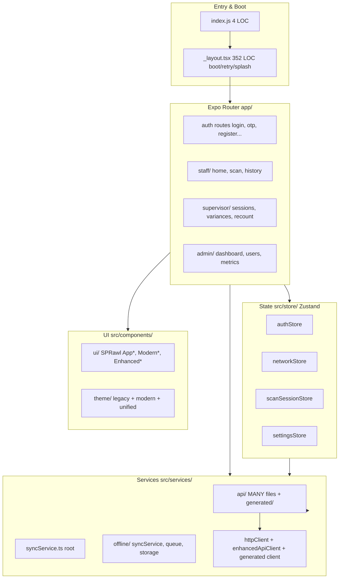
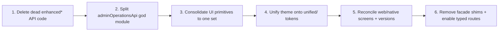

# Frontend Architecture & Code Quality Review

**Scope:** `Stock_final/frontend` — Expo (React Native 0.83 + Web) app, Expo Router, React Query, Zustand, Axios, Zod, expo-sqlite.
**Stack:** React 19.2, Expo SDK 55, TypeScript 5.9, React Query 5, Zustand 5, React Native Web 0.21.

---

## 1. Executive Summary

The frontend is **functional and feature-rich**, with a solid foundation: clean role-based routing, well-separated Zustand domain stores, React Query for server state, and an offline-first architecture. However, it carries **significant accumulated tech debt** from at least **three successive redesign/refactor generations** (legacy → modern → unified → "enhanced") that were layered on top of each other rather than replacing what came before.

The dominant problem is **duplication and dead code at every layer**: API clients, UI primitives, theme tokens, and even platform-specific screens all exist in multiple parallel forms. This inflates bundle size, slows development, and creates inconsistency risk.

**Health grades:**

| Area | Grade | Notes |
| ------ | ------- | ------- |
| Routing / Navigation | A | Clean Expo Router, role-segmented |
| State management | A− | Good Zustand domain split |
| Offline / sync | B | Functional but fragmented across 2 service trees |
| API layer | C | God module + ~470 LOC dead code + 3 HTTP clients |
| UI components | C− | Severe primitive sprawl (7 button, 5 card, 4 input variants) |
| Theme / styling | C− | 3 generations of tokens coexisting, inconsistent access |
| Screen consistency | D | Web vs native diverge heavily; inconsistent versions |

---

## 2. Architecture Overview

---

## 3. What's Working Well (Keep)

1. **Role-based routing** — `app/admin`, `app/staff`, `app/supervisor` with per-role `_layout.tsx` and guards ([`AuthGuard`](Stock_final/frontend/src/components/auth/AuthGuard.tsx:25), [`RoleLayoutGuard`](Stock_final/frontend/src/components/auth/RoleLayoutGuard.tsx:16)). Clear and scalable.
2. **Domain-split Zustand stores** — `authStore`, `networkStore`, `scanSessionStore`, `settingsStore`, `filterStore`, `notificationStore`. Each is cohesive and well-tested (`__tests__/` alongside).
3. **React Query for server cache** — correct choice; [`queryClient.ts`](Stock_final/frontend/src/services/queryClient.ts:1) centralizes config.
4. **Offline-first design** — `services/offline/` (queue, storage, count-line) + control-plane repositories in `data/repositories/`. Architecturally sound.
5. **Strong test/governance scaffolding** — Jest, Playwright e2e, Storybook, plus custom governance scripts (`check-ui-governance.cjs`, `check-web-bundle-regression.cjs`, `knip`). The tooling to *detect* this debt already exists.
6. **Typed OpenAPI generated client** — `src/api/generated/` is the "correct" typed surface (the right end-state).

---

## 4. Tech Debt Findings (by severity)

### 🔴 CRITICAL — Dead code in the API barrel

[`src/services/api/index.ts`](Stock_final/frontend/src/services/api/index.ts:1) re-exports three modules that are **never imported anywhere** in the codebase (verified via search):

- [`enhancedApi.ts`](Stock_final/frontend/src/services/api/enhancedApi.ts:9) — `EnhancedApiService` hand-rolls a Map-based cache + loading-state manager. **Redundant**: React Query already does this. (~117 LOC)
- [`enhancedApiClient.ts`](Stock_final/frontend/src/services/api/enhancedApiClient.ts:290) — a second HTTP client for `/api/v2`. (~291 LOC)
- [`enhancedDatabaseApi.ts`](Stock_final/frontend/src/services/api/enhancedDatabaseApi.ts:60) — `EnhancedDatabaseAPI` class. (~60+ LOC)

**Impact:** ~470 LOC of dead code shipped, confusing onboarding, parallel "enhanced" concept that misleads. **Fix:** delete the three files and their re-exports; run `knip` (already configured) to confirm.

### 🔴 CRITICAL — God module: `adminOperationsApi.ts`

[`adminOperationsApi.ts`](Stock_final/frontend/src/services/api/adminOperationsApi.ts:1) is ~830 LOC mixing **8+ unrelated domains**: service status, system health, device/login mgmt, log mgmt, permissions, export schedules, sync conflicts, metrics, reports, SQL-server config, security dashboard, master settings. It is then re-aggregated in [`api.impl.ts`](Stock_final/frontend/src/services/api/api.impl.ts:566) into grouped objects (`metricsApi`, `securityApi`, etc.) — a second manual grouping layer.
**Fix:** split by domain into `admin/` subfolder mirroring the grouped exports that already exist.

### 🟠 HIGH — UI primitive sprawl

[`src/components/ui/`](Stock_final/frontend/src/components/ui/index.ts:1) contains multiple generations of the same primitives:

- **Buttons (7):** `AppButton`, `EnhancedButton`, `ModernButton`, `RippleButton`, `AnimatedPressable`, `MyPressable`, `AppTouchable`
- **Cards (5):** `AppCard`, `GlassCard`, `ModernCard`, `AnimatedCard`, `SwipeCard`
- **Inputs (4):** `AppInput`, `AnimatedInput`, `EnhancedInput`, `ModernInput`
- **Headers (3):** `ModernHeader`, `PremiumHeader`, `ScreenHeader`
- **Bottom sheets (2):** `BottomSheet`, `EnhancedBottomSheet`
- **Loading (4):** `Skeleton`, `SkeletonList`, `Shimmer`, `LoadingSpinner` (+ `LoadingSkeleton.tsx` at components root)

Several are **thin facades** that just re-wrap the "Modern" version: `AppButton`→`ModernButton`, `AppInput`→`ModernInput`, `AppCard`→`ModernCard`, `ConfirmDialog`→`ConfirmModal`, `SyncIndicator`→`SyncStatusPill`. There is also [`legacyVisualSystem.ts`](Stock_final/frontend/src/components/ui/legacyVisualSystem.ts:1).
**Fix:** pick one canonical primitive per type (the `Modern*` set looks intended), delete facades and unused variants, update imports. The `governance:ui` scripts can enforce.

### 🟠 HIGH — Three generations of theme tokens

`src/theme/` ships legacy + modern + unified simultaneously:

- Legacy/bridge: `designSystem.ts`, `designTokens.ts`, `themeTokens.ts`, `themes.ts`, `enhancedColors.ts`, `modernDesign.ts`, `legacyCompat.ts`, `operationalStyleBridge.ts`, `operationalTheme.ts`
- Target (clean): [`unified/`](Stock_final/frontend/src/theme/unified/index.ts:1) (colors, radius, shadows, spacing, typography, animations)

[`theme/index.ts`](Stock_final/frontend/src/theme/index.ts:7) literally comments `UNIFIED THEME SYSTEM (NEW - Recommended)` yet still re-exports all legacy tokens. `src/styles/` adds a third surface: `globalStyles.ts`, `modernDesignSystem.ts`, `unifiedSystem.ts` (itself just `export * from "./modernDesignSystem"`).
**Inconsistent access patterns observed:** some screens use `useUiTokens()`, some `useThemeContext().theme` / `themeLegacy`, many import directly from `@/theme/legacyCompat`.
**Fix:** consolidate onto `unified/` + a single hook; retire `legacyCompat` and the bridge files.

### 🟠 HIGH — Web vs native screen divergence

Platform split files diverge far beyond rendering needs:

- [`IndexScreen.web.tsx`](Stock_final/frontend/src/screens/routes/IndexScreen.web.tsx:1) (50 LOC, `legacyCompat`, plain `StyleSheet`) vs [`IndexScreen.native.tsx`](Stock_final/frontend/src/screens/routes/IndexScreen.native.tsx:29) (143 LOC, `useThemeContext`, `ModernCard`, animations).
- [`WelcomeScreen.web.tsx`](Stock_final/frontend/src/screens/routes/WelcomeScreen.web.tsx:1) vs `.native.tsx` — different feature lists, different component libraries, ~150 LOC difference.

**Inconsistent version strings:** native Index shows `v2.0.0 • Aurora Engine`, native Welcome shows `v2.5 Enterprise`, `package.json` is `2.1.0`.
**Fix:** extract shared logic/hooks; keep `.web`/`.native` splits only for truly platform-specific rendering; single source of truth for version.

### 🟡 MEDIUM — Compatibility facade shims everywhere

Repeated pattern of "split god module, leave a re-export shim":

- [`api.ts`](Stock_final/frontend/src/services/api/api.ts:1) → re-exports `api.impl.ts`
- [`offlineQueue.ts`](Stock_final/frontend/src/services/offlineQueue.ts:1) → re-exports `offline/offlineQueue.ts`
- `unifiedSystem.ts` → re-exports `modernDesignSystem.ts`

These are harmless individually but collectively add navigational indirection. **Fix:** after import migration, delete shims.

### 🟡 MEDIUM — Multiple sync/offline abstractions

Two service trees coexist: root `services/syncService.ts` + `services/syncQueue.ts` + `services/syncStatusPolling.ts` AND `services/offline/syncService.ts` + `offlineQueue.ts` + `offlineStorage.ts`. Both are actively used (different responsibilities), but the naming overlap (`syncService` in two places) is confusing. **Fix:** rename for clarity or merge under `services/sync/`.

### 🟡 MEDIUM — Boot sequence complexity

[`app/_layout.tsx`](Stock_final/frontend/app/_layout.tsx:31) (352 LOC) implements custom boot progress, stall detection, hard timeout (14s), and retry with backoff. Reasonable for a production app, but it's a lot of imperative logic in the root layout — candidate for extraction into a `useBootSequence()` hook.

### 🟢 LOW — `as any` casts in navigation

`router.replace(target as any)` appears in multiple screens ([IndexScreen](Stock_final/frontend/src/screens/routes/IndexScreen.web.tsx:23), [WelcomeScreen](Stock_final/frontend/src/screens/routes/WelcomeScreen.web.tsx:27)). Expo Router supports typed routes; enabling `experiments.typedRoutes` would remove these casts.

---

## 5. Recommended Cleanup Plan (prioritized)

1. **Delete dead API code** — remove `enhancedApi.ts`, `enhancedApiClient.ts`, `enhancedDatabaseApi.ts` + barrel re-exports; verify with `npm run knip:check`.
2. **Split `adminOperationsApi.ts`** — break into domain files under `services/api/admin/`; keep grouped re-exports for compatibility.
3. **Collapse UI primitives** — choose canonical set (Modern*), delete facades/unused variants, codemod imports; enforce via `governance:ui:strict`.
4. **Unify theming** — migrate all consumers to `unified/` + single hook; delete `legacyCompat` and bridge files.
5. **Reconcile platform screens** — share hooks/logic; fix version string to a single constant.
6. **Remove shims & enable typed routes** — delete compatibility facades; turn on `typedRoutes`.

## 6. Suggested Guardrails (already half-built)

- Promote `knip`, `governance:ui:strict`, and `bundle:web:guard` into CI (the `ci` script currently runs only `lint + typecheck + test`).
- Add a "no new legacy imports" ESLint rule once `legacyCompat` is deprecated.

---

*Review based on static analysis of structure, imports, and representative files. Running `npm run typecheck`, `npm run lint`, and `npm run knip:check` would quantify remaining errors and confirm dead-code removals.*
